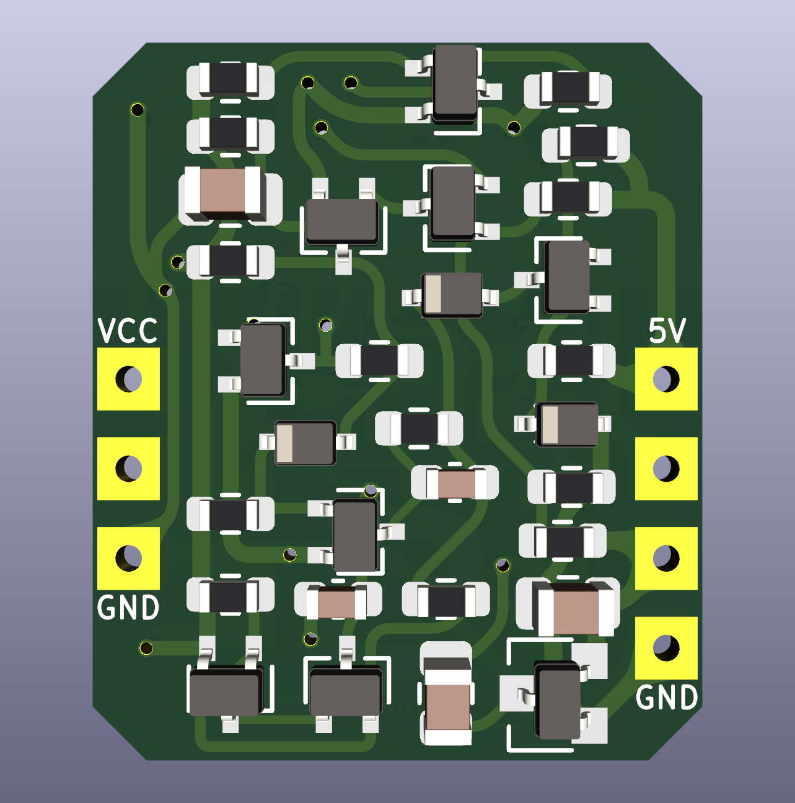

# Game Boy Color (CGB) DC/DC Board
  
"Reverse engineered" an OEM Game Boy Color CGB DC/DC Board and re-created it in KiCad.

For those that have transferred CGB components to a replacement PCB (e.g. n64freak's CGB/Pocket Color replacement boards) and wish to have a matching color PCB for the DC/DC board.  There are other aftermarket options for the DC/DC board, but this one retains the original 5V, 13.6V and -15V rails, so you can use the stock CGB screen.

# Ordering and Assembly

Upload the gerber to a PCB fab (JLCPCB, PCBWay, OSHPark) with a board thickness of 0.8mm and in your favorite color.  Then transfer the components from an original CGB DC/DC Board (verify the correct polarity of the diodes when transferring).  

**Note:** this PCB can only be used with components from the specific CGB DC/DC Board pictured above. Other variations of the CGB DC/DC Board will not work.

# Disclaimer

Note: This has not been tested. Please use at your own risk.

You will need to transfer components from a working Game Boy Color DC/DC Board for this PCB to work.  Please do not undertake this if you are inexperienced in soldering; populating this PCB will require desoldering and micro-soldering surface mount components.  I do not take responsibility or accept blame for any damage to your Game Boy Color or CGB DC/DC Board. 

If you identify any issues with the PCB design, please contact me on discord: *skimzor#5078.*

# License

 
 
This project/PCB is licensed under a Creative Commons Attribution-NonCommercial-ShareAlike 4.0 International License. ***Under this license, you are not permitted to profit from or commercialize this project.***
